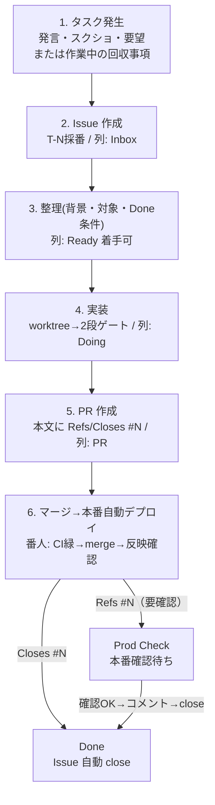

# タスク管理 Issue / Project 運用仕様

## 目的

タスク管理の正本を GitHub Issue に置き、GitHub Project を人間向けの一覧にする。AI は GitHub Issue API / Issue 本文 / PR を一次情報として読む。

これにより:

- 人間が GitHub Issue / Project で直感的に確認できる
- AI がタスク番号・状態・次アクション・関連 PR を機械的に追える
- 単一巨大 Markdown 台帳の並行編集による内容クロバー事故を構造的に避ける
- Issue / PR / CI / Production 確認 / 完了履歴を GitHub 上で自然に紐付ける

この運用は、明示的な「タスク追加」だけでなく、作業中に見つけた回収事項にも適用する。

## 基本方針（役割分担）

| 役割 | 置き場 |
|---|---|
| タスクの正本 | GitHub Issue |
| 人間向け一覧 | GitHub Project |
| AI 向け入口 | GitHub Issue API / Issue 本文 |
| 実装差分 | Pull Request |
| 本番反映履歴 | Issue コメント / PR |

原則:

> Issue = タスク正本 ／ Project = 人間の一覧 ／ Issue API = AI の入口 ／ 状態 = Project カラム

- 状態 `status:*` ラベルと Project カラムの二重管理は禁止（状態は Project カラムを正とする）。
- 手書き索引は作らない。必要なら Issue から自動生成する。

## 発見駆動の回収事項

実装・調査・レビュー・本番確認の途中で見つかった追加作業もプロジェクト管理対象とする。

| 発見したもの | 置き場 | Project Status |
|---|---|---|
| 既存タスク内の小さな追加・補足 | 既存 Issue / PR コメント | 既存のまま |
| 別作業として追跡すべき不具合・追加実装・調査 | 新規 Issue | Inbox / Ready |
| 判断・外部情報・データ待ち | 新規/既存 Issue | Waiting |
| main マージ済みで本番/ユーザー確認待ち | 既存 Issue | Prod Check |
| 作業ではない恒久ルール・方針 | `notes/` | タスク化しない |
| 対応済みだが履歴に残すべきもの | closed Issue / Issue コメント | Done |

- 回収事項を自分の記憶やローカルメモだけに置かない。
- 緊急で先に直した場合も、完了履歴として Issue コメントまたは closed Issue に残す。

## タスク番号

- `T-N` 形式。新規はその時点の最大 +1。番号は再利用しない。
- タイトル形式は `T-N: 短いタスク名`。

## Issue 本文テンプレート

```md
## 背景
なぜ必要か。発言・スクショ・既存挙動など。

## 対象
- 対象ページ:
- 対象コンポーネント:
- 対象外:

## 実装方針
- 既存パターン:
- 変更方針:
- 注意点:

## Done 条件
- [ ] 期待する表示/挙動になっている
- [ ] 対象外画面へ波及していない
- [ ] tsc / lint / 関連テストが通る
- [ ] PR を作成して Issue と紐付ける（Refs/Closes #N）
- [ ] Production 反映後に確認する

## 関連
- PR:
- 参考:
```

## 完了コメントテンプレート

```md
## 完了
- PR: PR #XXX
- squash: `xxxxxxx`
- Production: Ready / 確認済み
- 本番確認: `/path` 200 / 主要表示 OK
- 補足: 残課題があれば別 Issue 化
```

## GitHub Project 仕様

推奨カラム（状態の正本）:

| カラム | 意味 |
|---|---|
| Inbox | まだ整理前 |
| Ready | 着手可能 |
| Waiting | 判断・外部情報・データ待ち |
| Doing | 実装中 |
| PR | PR 作成済み |
| Prod Check | main マージ済み、本番確認待ち |
| Done | 完了 |

推奨自動化（手動ドラッグを最小化）:

- Issue 作成時 → `Inbox`
- PR 作成時 → 関連 Issue を `PR`
- PR merge 時 → `Prod Check`（`Closes` 付きなら `Done`）
- Issue close 時 → `Done`

## ラベル仕様

状態ラベルは使わない（状態は Project カラム）。種類ラベルのみ:

`type:bug` / `type:feature` / `type:content` / `type:i18n` / `type:legal` / `type:billing` / `type:data` / `type:mobile` / `type:ops`

担当/領域ラベルは必要に応じて追加する。

## PR との紐付け

PR 本文に関連 Issue を必ず記載する。

- マージだけで完了するタスク → `Closes #N`
- Production 確認やユーザー確認が必要なタスク → `Refs #N`（確認後に手動 close）

## フロー図



## AI 向けタスク取得

```bash
gh issue list --repo {{GH_OWNER_REPO}} --state open \
  --json number,title,labels,assignees,projectItems,updatedAt
gh issue view <n> --repo {{GH_OWNER_REPO}} --comments \
  --json number,title,body,comments,labels,projectItems,state
```

## 例外（Issue ではなく `notes/` に残す）

- 恒久的な開発ルール / セキュリティ運用 / デプロイ運用
- 価格・課金モデルの長期方針 / データ完全性ポリシー
- 複数タスクにまたがる設計メモ
